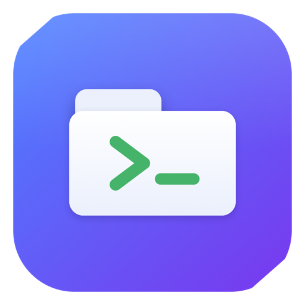
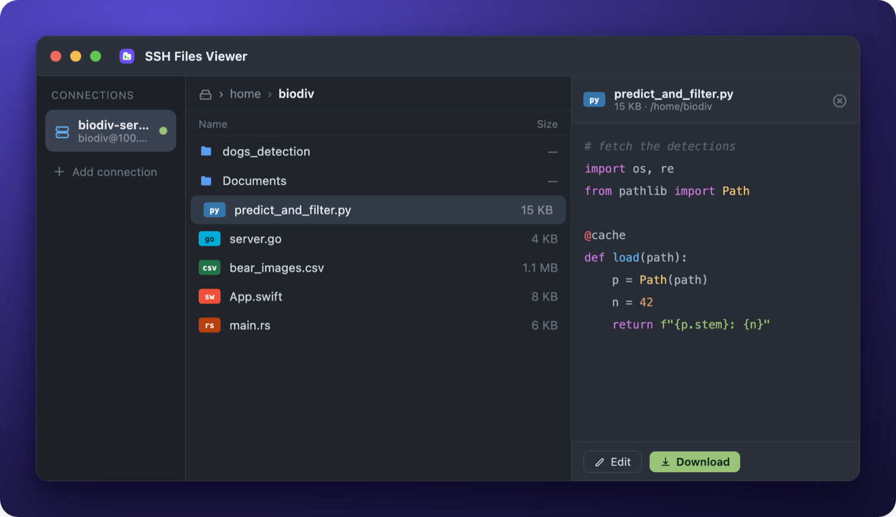

<p align="center">
  
</p>

<h1 align="center">SSH Files Viewer</h1>

<p align="center">
  A beautiful, native macOS app to browse, preview, edit, and download files on
  your remote machines over SSH.
</p>

<p align="center">
  
  
  
</p>

<p align="center">
  
</p>

## Features

- **Browse** any remote machine — breadcrumbs, history, live filter, and real language-logo file icons.
- **Preview** syntax-highlighted code (8 themes), images, and CSV/TSV as a spreadsheet, in a side panel or its own window.
- **Edit & save** text files in place — explicit save (⌘S), unsaved-changes indicator, save-on-close prompt, no autosave.
- **Download** with live progress, or open files in their default macOS app.
- **Connect** with an SSH agent, a key file, or a password (stored in the **Keychain**).
- **Fast & dependency-free** — drives the system `ssh` with connection multiplexing, reusing your `~/.ssh/config`, keys, and agent.

## Download

Get the latest `SSHFilesViewer.dmg` from the
[**releases page**](https://github.com/Alyetama/sshFilesViewer/releases/latest),
open it, and drag the app into **Applications**.

### Opening it the first time

The app is open-source and ad-hoc signed (no paid Apple Developer ID), so macOS
Gatekeeper blocks it on first launch. Do one of these once:

```bash
# Quickest — clear the quarantine flag, then open normally:
xattr -dr com.apple.quarantine /Applications/SSHFilesViewer.app
```

Or open it via the GUI: double-click → **Done**, then **System Settings →
Privacy & Security → Open Anyway**.

## Build from source

```bash
git clone https://github.com/Alyetama/sshFilesViewer.git
cd sshFilesViewer
./run.sh        # builds a release .app and launches it
```

Requires macOS 13+, the Swift toolchain (Xcode command-line tools), and `ssh`
(ships with macOS).

## Security

Passwords live in the macOS **Keychain** — never on disk in plaintext or on a
command line. Remote paths are shell-escaped, and the ssh hostname is passed
after `--` to block option injection. Saved connections are stored under
`~/Library/Application Support/SSHFilesViewer/`, not in this repo.

## License

[MIT](LICENSE) © Alyetama. Language logos are from
[devicon](https://github.com/devicons/devicon) (MIT).
